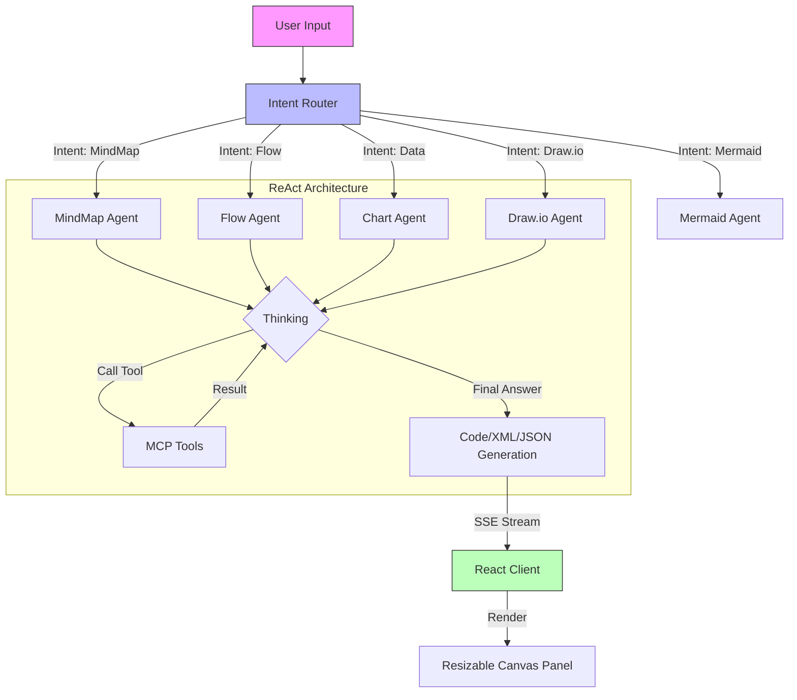

# DeepDiagram AI: Agentic AI Visualization Platform

**DeepDiagram AI** is an open-source, intelligent visualization platform that leverages **Agentic AI** to transform natural language into professional diagrams. Unlike traditional tools, DeepDiagram employs a multi-agent architecture where specialized agents handle different visualization domains—from interactive mind maps to complex data charts.

---

## 🚀 Features

### 🧠 Mind Map Agent
- **Powered by**: `mind-elixir`
- **Capabilities**: Generates structured, interactive mind maps.
- **Workflow**: Supports real-time preview and export to PNG.

### 🧜‍♂️ Flowchart Agent
- **Powered by**: `React Flow`
- **Capabilities**: Creates detailed flowcharts with a modern, interactive canvas.
- **Workflow**: Supports auto-layout and high-quality image export.

### 📊 Data Chart Agent
- **Powered by**: `Apache ECharts`
- **Capabilities**: Visualizes data using bar charts, line graphs, pie charts, and more.
- **Workflow**: Analyzes data or descriptions to generate rich ECharts configurations.

### ✏️ Draw.io Agent
- **Powered by**: `Draw.io` (Atlas Theme)
- **Capabilities**: Produces professional-grade technical diagrams compatible with the Draw.io ecosystem.
- **Workflow**: Advanced canvas with **auto-centering** and **sidebar concealment** for a focused drawing experience.

### 🧜‍♀️ Mermaid Agent
- **Powered by**: `Mermaid.js` + `react-zoom-pan-pinch`
- **Capabilities**: Generates complex diagrams including Sequence, Gantt, Timeline, State, and Class diagrams.
- **Workflow**: Native interactive canvas with adaptive scaling, zoom/pan controls, and high-resolution SVG/PNG export.

### 🤖 Intelligent Router & Multimodal
- **Context-Aware**: Automatically routes requests to the best agent based on intent using a ReAct-based orchestration layer.
- **Multimodal**: Supports image uploads. Upload a whiteboard photo or a sketch, and DeepDiagram AI will digitize it.

---

## ✨ User Interface Enhancements

- **Modern Chat Input**: Redesigned input card with a clean, border-box layout and bottom-aligned action buttons (Paperclip for uploads, Send for submission).
- **Stable Layout**: Image previews are positioned above agent shortcuts to ensure the toolbar remains static and accessible during uploads.
- **Resizable Layout**: Flexibly adjust the width of the drawing canvas and chat panel using a professional-grade draggable separator.
- **Process Trace Actions**:
  - **Contextual Render**: Trigger agent-specific rendering directly from the process trace.
  - **Live Feedback**: Real-time status tags (e.g., "Render Failed") that clear instantly on successful re-runs.
  - **Trace Logs**: Formatted JSON logs for debugging and transparency.

---

## 🏗 System Architecture

DeepDiagram AI uses a **React + FastAPI** architecture, orchestrated by **LangGraph**. Updates are streamed to the frontend via **SSE (Server-Sent Events)** for a live preview experience.



---

## 🛠 Tech Stack

- **Frontend**: React 19, Vite, TypeScript, TailwindCSS, Zustand, React Flow, Mind-elixir, react-resizable-panels.
- **Backend**: Python 3.10+, FastAPI, LangGraph, LangChain, DeepSeek/OpenAI.
- **Package Manager**: `uv` (Python), `npm` (Node.js).

---

## 🏁 Getting Started

### Prerequisites
- **Python**: 3.10 or higher
- **Node.js**: v18 or higher
- **uv**: `pip install uv`

### 1. Backend Setup
```bash
cd backend
uv sync
bash start_backend.sh
```

### 2. Frontend Setup
```bash
cd frontend
npm install
npm run dev
```

Visit `http://localhost:5173` to start using DeepDiagram AI.

---

## 📖 Usage Guide

1.  **Natural Language & Multimodal**: Type your request or upload an image (e.g., "Create a flow chart for user login").
2.  **Interactive Canvas**: Drag and resize the panels to suit your workflow.
3.  **Export & Share**: Use the toolbar over the diagram to download as PNG or SVG.
4.  **Refine**: Ask the AI to tweak the result (e.g., "Add a 'Forgot Password' step to the flow").

---

## 🗺 Roadmap

- [x] MVP with 3 Core Agents (MindMap, Flow, Charts)
- [x] Draw.io Integration
- [x] Standalone Mermaid Agent
- [x] Resizable Dashboard Layout
- [x] Enhanced Message Actions & Copy Logic
- [ ] chat history 
- [ ] new chat   
- [ ] other file upload
