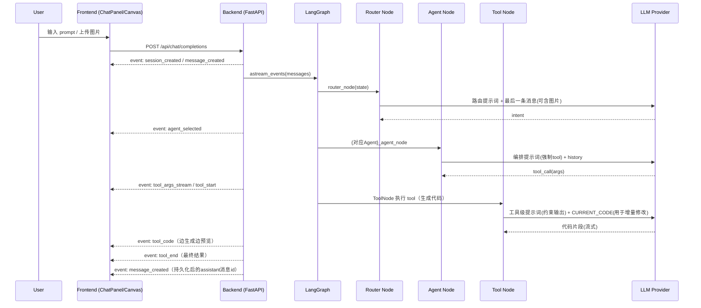
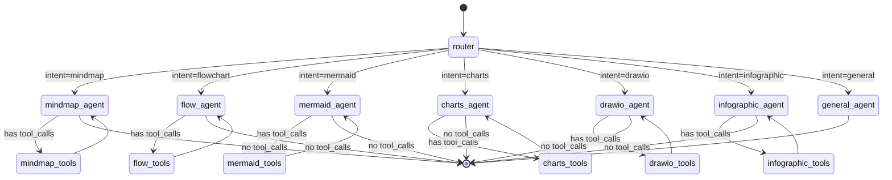
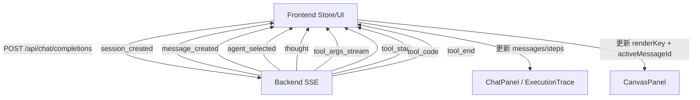
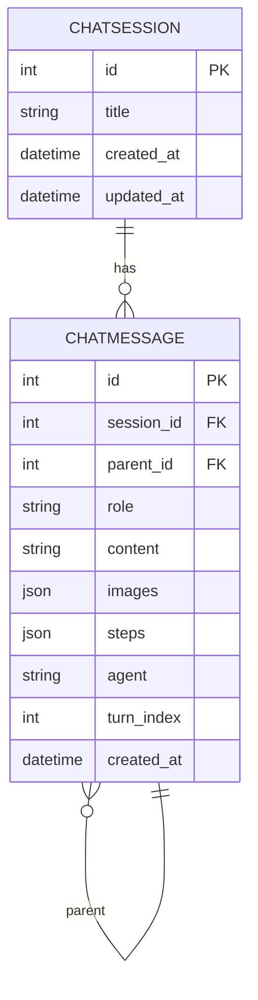

# DeepDiagram AI（三分文档 2/3）：架构与数据流（Mermaid 多视角）

## 1）部署视角（Docker Compose / 进程边界）

```mermaid
graph LR
  U[User Browser] -->|HTTP :80| N[Nginx / Frontend Container]
  N -->|/ (static)| FE[React SPA]
  N -->|/api/* reverse proxy| BE[FastAPI Backend :8000]
  BE -->|asyncpg| DB[(Postgres :5432)]

  subgraph Docker Compose
    N
    BE
    DB
  end
```

## 2）运行时数据流（SSE 流式：消息 + 画布）



## 3）编排视角（LangGraph 状态机：Router→Agent↔Tools）



## 4）事件视角（SSE 事件=前后端契约）



## 5）数据模型视角（会话、消息、分支/版本）



